<!-- Generated by scripts/build.mjs from profile.json. Edit profile.json, not this file. -->
<div align="center">

<a href="https://prakharmartand.github.io/PrakharMartand/"></a>

<a href="https://prakharmartand.github.io/PrakharMartand/"></a> <a href="https://prakharmartand.github.io/PrakharMartand/#recruiter"></a> <a href="[LinkedIn URL]"></a> <a href="[Website URL]"></a> <a href="mailto:[Email Address]"></a>

</div>

<br>



<details>
<summary><b>👔 Recruiter? Here's the 30-second version</b></summary>
<br>

> Software Development Engineer in Test at Prophecy, previously an SDET Consultant at Harness. I design automation that catches regressions before they ship, and lately I build agentic AI workflows, custom skills and knowledge bases that make testing smarter.

| | |
|---|---|
| **Role** | SDET @ [Prophecy](https://www.prophecy.io/) |
| **Previously** | SDET Consultant @ [Harness](https://www.harness.io/) |
| **Testing** | Playwright · Cypress · Selenium · Java + TestNG · PyTest · Postman |
| **Languages** | TypeScript · JavaScript · Python · HTML · CSS |
| **CI / Cloud** | GitHub Actions · Docker · AWS · Git |
| **Now exploring** | Agentic AI workflows that write, triage and heal tests · Custom skills + knowledge bases for engineering teams · Fast, flake-free E2E suites wired into CI |
| **Contact** | [LinkedIn]([LinkedIn URL]) · [Email](mailto:[Email Address]) · [Open a hire request](https://github.com/PrakharMartand/PrakharMartand/issues/new?template=hire.yml) · [Printable résumé](https://prakharmartand.github.io/PrakharMartand/#recruiter) |

</details>

<details>
<summary><b>🧑‍💻 Developer? Read the config</b></summary>
<br>

```ts
// prakharmartand.config.ts
export default defineConfig({
  name: 'Prakhar Martand',
  role: 'SDET @ Prophecy',
  previously: ['SDET Consultant @ Harness'],
  projects: [
    { name: 'testing', use: ['Playwright', 'Cypress', 'Selenium', 'Java + TestNG', 'PyTest', 'Postman'] },
    { name: 'languages', use: ['TypeScript', 'JavaScript', 'Python', 'HTML', 'CSS'] },
    { name: 'ci / cloud', use: ['GitHub Actions', 'Docker', 'AWS', 'Git'] },
    { name: 'ai / agentic', use: ['Agentic workflows', 'Skill creation', 'Knowledge bases', 'AI for QA'] },
  ],
  exploring: [
    'Agentic AI workflows that write, triage and heal tests',
    'Custom skills + knowledge bases for engineering teams',
    'Fast, flake-free E2E suites wired into CI',
  ],
  retries: 0, // flaky tests get fixed, not retried
  reporter: [['list'], ['hire-me', { open: 'always' }]],
});
```

</details>

<br>





<div align="center">

### Found a bug in me?

<a href="https://github.com/PrakharMartand/PrakharMartand/issues/new?template=bug.yml"></a> <a href="https://github.com/PrakharMartand/PrakharMartand/issues/new?template=hire.yml"></a>

<sub>This profile is a test suite. It is generated from <a href="profile.json"><code>profile.json</code></a> and re-runs every hour in GitHub Actions.<br>
Fork it, edit one file, and ship your own. See <a href="TEMPLATE.md"><code>TEMPLATE.md</code></a>.</sub>

</div>
